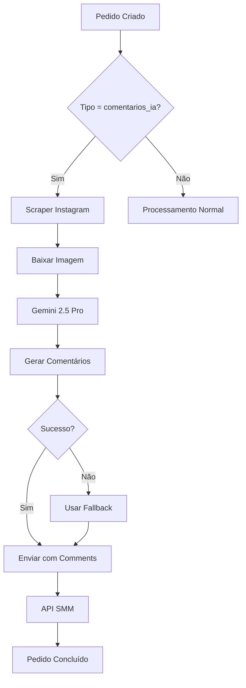

# 🤖 Teste do Sistema Comentários + IA

## 📋 **Como Testar a Nova Funcionalidade**

### **1. Configurar APIs**
1. Acesse **WP Admin > Pedidos Processando > Configurações SMM**
2. Role até a seção **"APIs para Comentários + IA"**
3. Configure:
   - **Gemini API Key**: Sua chave do Google AI Studio
   - **Instagram Scraper API Key**: Chave do RapidAPI
   - **Instagram Scraper API Host**: `instagram-social-api.p.rapidapi.com`
4. Clique em **"Testar Conexão"** e **"Testar Scraping"**

### **2. Configurar Produto**
1. Edite um produto no WooCommerce
2. Na seção **"Configurações SMM"**:
   - ✅ Marque **"Ativar envio automático SMM"**
   - 📱 Selecione **"Comentários + IA (Links)"** como tipo de lógica
   - 🔧 Configure provedor e Service ID
3. Salvar produto

### **3. Criar Pedido de Teste**
1. Crie um pedido com o produto configurado
2. Adicione campos do Instagram:
   - **Instagram Posts**: `https://www.instagram.com/p/C0UWodpJogI/`
   - **Instagram Reels**: `https://www.instagram.com/reel/ABC123/`
3. Marque o pedido como **"Processando"**

### **4. Verificar Processamento**
O sistema irá automaticamente:
1. 🔍 **Fazer scraping** da publicação Instagram
2. 📷 **Baixar a imagem/thumbnail**
3. 🤖 **Enviar para Gemini 2.5 Pro** com:
   - Caption da publicação
   - Informações do usuário
   - Imagem anexada
4. 💬 **Gerar comentários personalizados**
5. 📤 **Enviar para API SMM** com comentários (sem quantity)

## 🔧 **Formato de Envio para API SMM**

### **Antes (Posts/Reels normais):**
```json
{
    "service": 123,
    "link": "https://instagram.com/p/ABC123/",
    "quantity": 10,
    "runs": 1
}
```

### **Agora (Comentários + IA):**
```json
{
    "service": 123,
    "link": "https://instagram.com/p/ABC123/",
    "comments": "Que foto incrível! 😍\nAdorei esse estilo ✨\nPerfeita como sempre!\nQue charme! 🔥",
    "runs": 1
}
```

## 📊 **Logs de Debug**

### **Arquivo Principal:**
- `debug-pedidos-plugin.log` - Logs do processamento principal

### **Módulos Específicos:**
- `modules/debug-instagram-scraper.log` - Logs do scraping
- `modules/debug-gemini-comments.log` - Logs da geração IA

### **Exemplo de Log Esperado:**
```
[2025-01-XX XX:XX:XX] [INFO] [ENVIAR_PEDIDO_DISTRIBUIDO_INDIVIDUAL]: Produto de comentários + IA detectado - Iniciando geração inteligente
[2025-01-XX XX:XX:XX] [INFO] [ENVIAR_PEDIDO_DISTRIBUIDO_INDIVIDUAL]: Fazendo scraping da publicação: https://instagram.com/p/C0UWodpJogI/
[2025-01-XX XX:XX:XX] [INFO] [ENVIAR_PEDIDO_DISTRIBUIDO_INDIVIDUAL]: Scraping realizado com sucesso. Caption: Pat, pat, pat. ⁣ On today's #WeeklyFluff meet...
[2025-01-XX XX:XX:XX] [INFO] [ENVIAR_PEDIDO_DISTRIBUIDO_INDIVIDUAL]: Imagem baixada: SIM
[2025-01-XX XX:XX:XX] [INFO] [ENVIAR_PEDIDO_DISTRIBUIDO_INDIVIDUAL]: Gerando comentários com Gemini 2.5 Pro (quantidade: 4)
[2025-01-XX XX:XX:XX] [INFO] [ENVIAR_PEDIDO_DISTRIBUIDO_INDIVIDUAL]: Comentários gerados com sucesso (4 comentários)
[2025-01-XX XX:XX:XX] [INFO] [ENVIAR_PEDIDO_DISTRIBUIDO_INDIVIDUAL]: Enviando pedido com comentários usando orderWithComments
```

## 🎯 **Casos de Teste**

### **Teste 1: Post com Imagem**
- **URL**: `https://www.instagram.com/p/C0UWodpJogI/`
- **Esperado**: Comentários sobre gato/animal baseados na imagem

### **Teste 2: Reel com Vídeo**
- **URL**: `https://www.instagram.com/reel/ABC123/`
- **Esperado**: Comentários sobre movimento/ação no vídeo

### **Teste 3: Post com Hashtags**
- **URL**: Post com #fitness #motivation
- **Esperado**: Comentários relacionados ao tema

### **Teste 4: Fallback**
- **URL**: URL inválida ou API offline
- **Esperado**: Comentários padrão de fallback

## ⚠️ **Solução de Problemas**

### **Erro: "Gemini API Key não configurada"**
- Verificar se a chave foi salva corretamente
- Testar conexão na página de configurações

### **Erro: "URL do Instagram inválida"**
- Verificar formato da URL
- Aceita: `/p/ABC123/`, `/reel/ABC123/`, ou código direto

### **Erro: "Falha no scraping"**
- Verificar RapidAPI key
- Post pode estar privado ou deletado

### **Comentários de Fallback Ativados**
- Normal em caso de erro nas APIs
- Garante que o pedido sempre seja processado

## 🚀 **Fluxo Completo**



## 📞 **Suporte**

- **Logs**: Verifique os arquivos de log mencionados
- **APIs**: Teste as conexões na página de configurações  
- **Debug**: Ative `PEDIDOS_DEBUG = true` para logs detalhados
